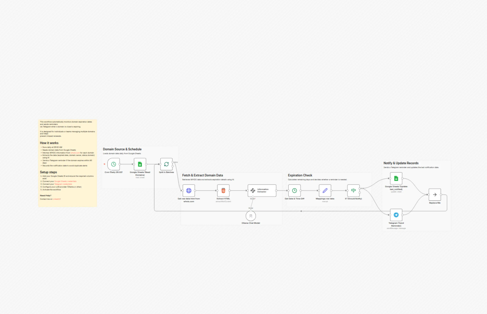

# Get domain expiry reminders with Google Sheets, WHOIS, Telegram, and Ollama AI

Advanced n8n automation for Get domain expiry reminders with Google Sheets, WHOIS, Telegram, and Ollama AI.

## Overview
- Category: DevOps, AI Summarization
- Complexity: advanced
- Source: n8n workflow template export

## What This Automation Does
Automate domain expiry monitoring with WHOIS + AI. Pull from Google Sheets, get Telegram alerts 90 days before/after expiry, avoid downtime.

## Included Files
- `workflow.json`

## Setup
1. Import `workflow.json` into n8n.
2. Configure required credentials for the services used in the workflow nodes.
3. Update any environment variables or static values inside nodes (API keys, URLs, IDs).
4. Run a test execution and then activate the workflow.

## Tech Stack

- `@n8n/n8n-nodes-langchain.informationExtractor`
- `@n8n/n8n-nodes-langchain.lmChatOllama`
- `n8n-nodes-base.cron`
- `n8n-nodes-base.dateTime`
- `n8n-nodes-base.googleSheets`
- `n8n-nodes-base.html`
- `n8n-nodes-base.httpRequest`
- `n8n-nodes-base.if`
- `n8n-nodes-base.noOp`
- `n8n-nodes-base.set`
- `n8n-nodes-base.splitInBatches`
- `n8n-nodes-base.stickyNote`
- `n8n-nodes-base.telegram`

## Author

Murtaza Baig

## Screenshots

## License
MIT License. See `LICENSE`.